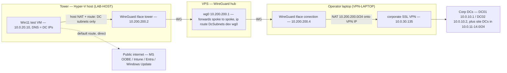

# Autopilot Hybrid Join — remote quick-test lab

A personal lab for validating a Windows **Autopilot Hybrid Azure AD Join** flow against a real
on-prem Active Directory, without shipping hardware to the site and without giving the test machine
any corporate credentials or VPN client of its own. The device under test is a throwaway Hyper-V VM
on a home tower; it reaches the customer's domain controllers over a double-hop WireGuard tunnel that
terminates on a remote laptop already holding the corporate SSL VPN.

This repository is the **method**, not a product. The interesting part is the network plumbing — a
split-tunnel that puts only the DC subnets on the tunnel while all Microsoft cloud OOBE traffic goes
direct — and a set of idempotent, parameterized PowerShell/bash scripts driven from a single config
file. All identifiers in this repo are fake placeholders (see [Scope and caveats](#scope-and-caveats)).

## Problem

Autopilot Hybrid Azure AD Join needs the enrolling device to have line-of-sight to a domain
controller during OOBE: it has to resolve the internal AD zone, find a DC via the DC-locator SRV
records, and talk to it over the usual AD ports so the Offline Domain Join (ODJ) blob created by the
on-prem Intune Connector can be applied. In a normal deployment the device is physically on the
corporate network. To test the flow remotely you either ship a machine to the site, or you find a way
to give a local VM a path to the DCs.

Two constraints make that path awkward:

- The only corporate access available is an SSL VPN installed on a **remote** laptop, in a different
  location from the Hyper-V host. Both machines sit behind NAT with no public endpoint, so they cannot
  peer directly.
- The corporate RFC1918 space overlaps the host's own home LAN, so a naive full tunnel or a broad route
  would blackhole local traffic.

## Approach

A three-node WireGuard mesh. Because neither spoke has a public endpoint, a small public VPS acts as
the hub and forwards spoke-to-spoke. The VM's default route stays on the tower's normal internet; only
the DC subnets are routed into the tunnel.



Data path for a DC-bound packet:

```
VM (10.0.20.0/24) -> tower NAT -> WG -> VPS hub -> WG -> laptop -> NAT onto corp SSL VPN -> DCs
```

Everything else the VM sends — every Autopilot, Intune, Entra and Windows Update endpoint — leaves the
tower on its normal local internet and never touches the tunnel.

### Why split tunnel, and how it is enforced

Pushing all VM traffic through the far laptop and the corporate SSL VPN would send every cloud OOBE
call through the remote site and the corporate proxy / SSL-inspection path. That is slow and a likely
failure point, and none of it needs the tunnel. Only the DC subnets do. So the VM gets a default route
to the tower's internet and specific `/24` routes for the DC subnets into WireGuard.

The routing is enforced by WireGuard's cryptokey routing (`AllowedIPs`), which acts in **both**
directions: a destination is only sent to a peer if it is in that peer's `AllowedIPs`, and an inbound
packet is only accepted if its **source** is in the sending peer's `AllowedIPs`. So each DC subnet has
to be added to `AllowedIPs` in two places — the tower's hub-peer and the VPS's laptop-peer — or the
return traffic is dropped. Only specific DC `/24`s are added, never a supernet, because the corp space
overlaps the host LAN.

One gotcha is worth stating plainly: on the VPS, a runtime `wg set wg0 peer ... allowed-ips ...`
updates cryptokey routing but does **not** install the kernel route needed to actually forward packets
out `wg0` — `wg-quick` only adds those from `AllowedIPs` at (re)start. So `scripts/30-vps-wireguard.sh`
also runs `ip route replace <subnet> dev wg0` for each DC subnet.

### DNS

The VM's DNS servers are the DC IPs themselves. The internal AD zone (`corp.example.com`) and the
DC-locator SRV records resolve across the tunnel, and the DCs forward public names for ordinary
internet resolution. DNS therefore traverses the tunnel while the Microsoft-cloud data path stays
direct — the standard hybrid-join-over-VPN model. Because the DC-locator can steer the VPN endpoint
(by AD site) to a DC in a different subnet than the primary, several DC-hosting `/24`s are tunneled,
not just the HQ one.

### Offline hardware-hash capture and hands-off install

Two supporting mechanisms avoid the usual OOBE friction on a headless VM:

- **Hardware hash, captured offline.** A small FAT32 VHDX (label `XFER`) carries `extract-hash.ps1`,
  which reads `DeviceHardwareData` from WMI (`root/cimv2/mdm/dmmap MDM_DevDetail_Ext01`) and writes
  `hash.csv`. The disk is dismounted and read on the host. No credentials, no network, and no reliance
  on Shift+F10 keyboard focus. Built by `scripts/lib/New-HashTransferDisk.ps1`.
- **Hands-off install.** A generated answer ISO with `autounattend.xml` at its root wipes disk 0, lays
  out UEFI partitions, installs Windows 11 Pro to OOBE, and in the specialize pass runs `setup-net.ps1`
  (static lab IP — there is no DHCP on the isolated internal vSwitch) and `extract-hash.ps1`. The ISO is
  built by `scripts/lib/New-AnswerIso.ps1`.

For the fully headless case, `scripts/lib/HyperVConsole.ps1` drives the VM through the Hyper-V
`root\virtualization\v2` WMI API — framebuffer screenshots plus keyboard injection — with no guest
agent and no network.

## Repository layout

| Path | Purpose |
|------|---------|
| `config/environment.ps1` | Single source of truth — every IP, subnet, name, key and path. Edit here to retarget the lab. |
| `secrets/secrets.example.ps1` | Template for the git-ignored `secrets/secrets.ps1` (VPS SSH host/user/pass/port). |
| `scripts/10-tower-network.ps1` | Tower: internal vSwitch, IP forwarding, NAT, WireGuard `AllowedIPs` and DC-subnet routes. |
| `scripts/20-laptop-network.ps1` | Laptop (run elevated): IP forwarding + NAT of the WG range onto the corporate VPN adapter. |
| `scripts/30-vps-wireguard.sh` | VPS hub: add DC subnets to the laptop-peer `AllowedIPs` and install `ip route ... dev wg0`. |
| `scripts/40-create-vm.ps1` | Build the Gen2 Win11 VM (UEFI, Secure Boot, vTPM) on the isolated switch. |
| `scripts/60-autopilot-import.ps1` | Device-code Graph sign-in, import the hardware hash, sync, add to the Autopilot group. |
| `scripts/65-add-to-group.ps1` | Re-run the group-add once the Entra device object exists (silent, saved refresh token). |
| `scripts/90-verify-enrollment.ps1` | Verify enrollment: Intune, Entra trust type, Autopilot state, group, LAPS, and the on-prem OU via LDAP. |
| `scripts/lib/Get-GraphToken.ps1` | Silent Graph token from the saved refresh token. |
| `scripts/lib/Invoke-Vps.ps1`, `vps_ssh.py` | Run a command on the VPS over SSH (paramiko, credentials from env). |
| `scripts/lib/New-AnswerIso.ps1`, `New-HashTransferDisk.ps1`, `HyperVConsole.ps1` | Answer ISO, offline-hash transfer disk, headless console control. |
| `artifacts/` | Sample answer file, network/hash extractor scripts, and clearly-fake sample `hash.csv` / `autopilot-device.txt`. |
| `docs/01..04` | Network design and rationale, discovery notes, the OOBE runbook, and the resume procedure. |

## Runbook

1. Edit `config/environment.ps1` for your tenant, domain, DC IPs, subnets and hostnames. Copy
   `secrets/secrets.example.ps1` to `secrets/secrets.ps1` and fill in the VPS SSH values.
2. Bring up the WireGuard `tower` tunnel; confirm the laptop is on the corporate VPN and its
   `conection` tunnel to the VPS is up.
3. `scripts/30-vps-wireguard.sh` on the VPS — add DC subnets to the laptop-peer `AllowedIPs` and the
   `ip route ... dev wg0` kernel routes.
4. `scripts/20-laptop-network.ps1` on the laptop (elevated) — forwarding + NAT of the WG range onto the
   corporate VPN adapter.
5. `scripts/10-tower-network.ps1` on the tower (elevated) — vSwitch, NAT, routes and `AllowedIPs`.
6. Confirm the path before enrolling: from the tower's NAT source, the AD ports (DNS 53, Kerberos 88,
   LDAP 389, LDAPS 636, SMB 445, RPC 135, GC 3268/3269, NTP 123) should be open to the DCs and the
   internal zone should resolve. See `docs/01-network-design.md` for the exact checks.
7. `scripts/40-create-vm.ps1` — build the VM (needs a Windows 11 ISO). Install to OOBE via
   `autounattend.xml`; the specialize pass sets the static IP and captures the hardware hash.
8. `scripts/60-autopilot-import.ps1 -HashCsv artifacts\hash.csv` — register the device with Autopilot
   and add it to the deployment group. Wait until the profile shows **Assigned**.
9. Boot the VM through OOBE and let Autopilot + the Enrollment Status Page run. See
   `docs/03-oobe-runbook.md`.
10. `scripts/90-verify-enrollment.ps1` — confirm hybrid join, compliance, the computer object in the
    target OU, LAPS, and that the enrollment scripts ran.

`docs/04-resume.md` covers picking the run back up after the remote laptop has been offline.

## Design notes for the scripts

- Idempotent — each script checks current state before changing it, so re-running is safe.
- Parameterized — no literals in the phase scripts; everything is read from `config/environment.ps1`.
- Reversible — each script documents a rollback (see the trailing comment block in each file, and the
  per-node rollback list in `docs/01-network-design.md`).
- No secrets in git — VPS credentials and the Graph refresh token live under the git-ignored `secrets/`.

## Status and limitations

What is built and has been exercised end-to-end at least once:

- The double-hop WireGuard path and the split-tunnel routing. From the tower's NAT source, TCP 389 /
  445 / 88 / 135 / 3268 were confirmed open to both HQ DCs, with ICMP and DNS/SRV resolution working.
  The VPS `ip route ... dev wg0` gotcha above was found and fixed during this bring-up.
- VM build (Gen2, vTPM, Secure Boot), the answer-ISO install to OOBE, the static-IP specialize step,
  and offline hardware-hash capture via the `XFER` disk.
- Hardware-hash import into Autopilot over the Graph device-code flow, and dynamic-group membership.

What is designed and scripted but was **not** run to completion in the reference pass:

- The interactive Autopilot Hybrid Join itself — the org sign-in, the ODJ connector creating the
  computer object, ESP, and the final `dsregcmd` state. The reference run was paused before this step
  because the remote laptop had to go offline; the join is expected to complete once the path is back
  up, but it has not been observed here. Treat `scripts/90-verify-enrollment.ps1` as the check for that
  step rather than as evidence it passed.

Other limits worth knowing:

- The headless Shift+F10 path at OOBE is unreliable because the command window does not always take
  keyboard focus; that is why network and hash capture were moved into the answer-file specialize pass.
- The corporate leg assumes the VPN vendor pushes a route to the DC subnets and permits the laptop's
  VPN IP as a source. `scripts/20-laptop-network.ps1` matches the VPN adapter by its interface
  description, which you will need to set for your own client.
- This is a single-operator test lab, not production tooling. There is no CI, no packaging, and the
  scripts assume Windows PowerShell 5.1 on the host.

## Scope and caveats

This is a personal, reusable quick-test lab, presented as a method. Every identifier here is a generic
placeholder: `Contoso` / `corp.example.com` / `contoso.onmicrosoft.com`, `DC01`–`DC08`,
`10.0.10.0/24`–`10.0.14.0/24` for corp, `10.0.20.0/24` for the VM, `10.0.30.0/24` for the VPN leg, and
`10.200.200.0/24` for the WireGuard mesh. The WireGuard public keys, the Autopilot/Entra GUIDs, the
device serial and the hardware hash in `artifacts/` are obviously-fake samples, not captured values —
`artifacts/hash.csv` is literally a `SAMPLEHASHDONOTUSE...` string and will not import. `config/environment.ps1`
is the one file to edit for your own tenant and domain; the phase scripts read everything from it.
